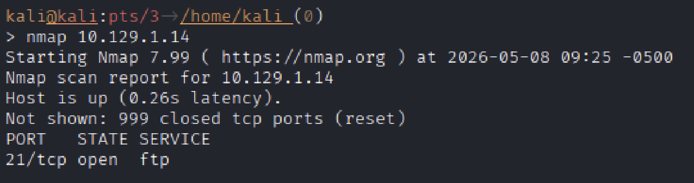
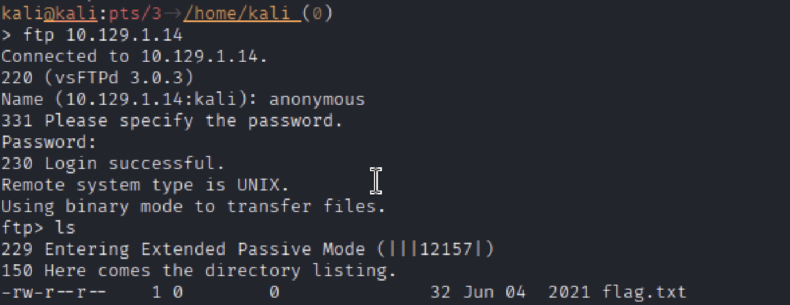
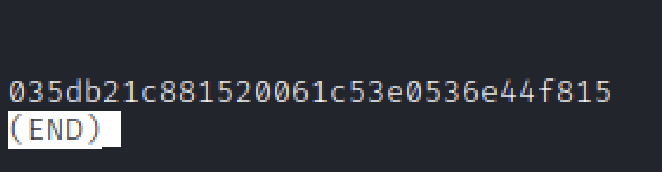

# Hack The Box — [FAWN]

- Platform: Hack The Box
- Lab Type: Starting Point
- Operating System: Linux- Ubuntu 
- Difficulty: [Very Easy]
- Date Completed: [05/08/26]
- Author: Teal (Dalton Wright)

## Objective

- The objectiveo f this lab is to use a misconfigured File Transfer Protocol (FTP) misconfiguration to find the file containing the flag.

## Skills Demonstrated

- Network Enumeration usig Nmap
- FTP

## Enumeration

- Network enumeration found the TCP port 21 for FTP open

### Nmap Scan

Command Used:
nmap 10.129.1.14

## Exploitation

- Failing to disable anonymous login on an FTP server can result in anonymous login that leaves sensitive files available for view and extraction.

### Initial Access

- Initial access was achieved by using the login credentials: 
    Username: anonymous
    Password: annonymous

## Privilege Escalation

- While privelege escaltion was unnecessary in this case, by neavigating the FTP server, the file labelled "falg.txt" was discovered and the falg was captured within the file contents.

## Flags Captured

## Lessons Learned
- It is important when configuring an FTP server that the anonymous access is disabled to prevent unauthorized access to sensitive files.